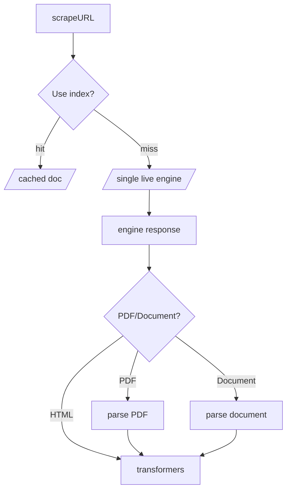

# `scrapeURL`
New URL scraper for Firecrawl

## Signal flow

## Differences from `WebScraperDataProvider`
 - The job of `WebScraperDataProvider.validateInitialUrl` has been delegated to the zod layer above `scrapeUrl`.
 - `WebScraperDataProvider.mode` has no equivalent, only `scrape_url` is supported.
 - You may no longer specify multiple URLs.
 - Built on `v1` definitons, instead of `v0`.
 - PDFs are now converted straight to markdown using LlamaParse, instead of converting to just plaintext.
 - DOCXs are now converted straight to HTML (and then later to markdown) using mammoth, instead of converting to just plaintext.
 - Using new JSON Schema OpenAI API -- schema fails with LLM Extract will be basically non-existant.
        
